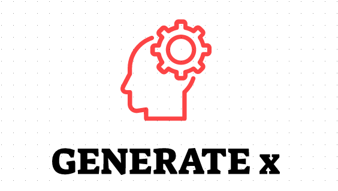
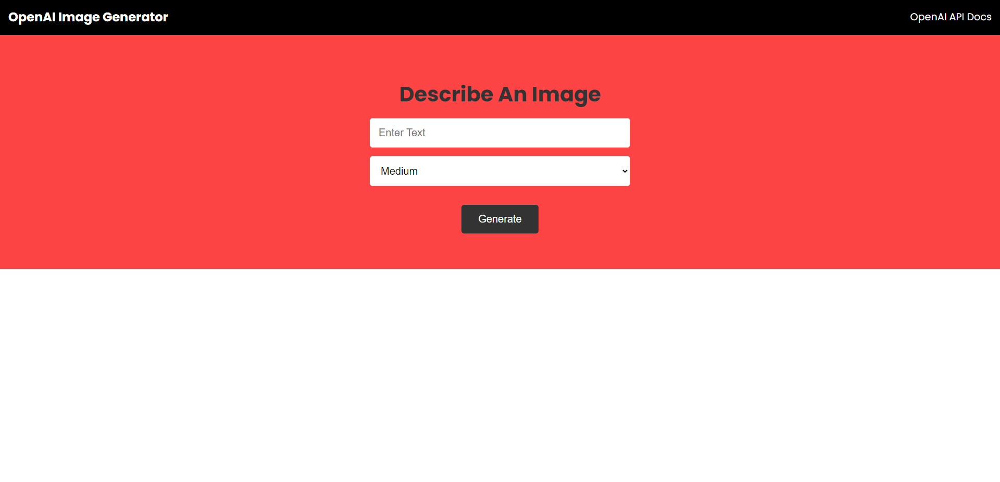
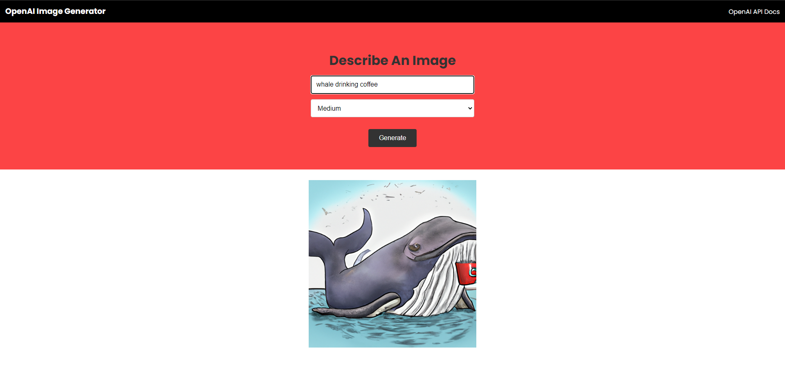

## Project Overview
Built a web application that creates images from scratch based on user‑provided text.

## Features
* It uses DALL·E 2 to create realistic images and art from a description in natural language.
* Used NodeJS to create a REST API endpoint for fetching the generated image and displaying it on frontend.

## Screenshots

## Tech Used
* OpenAI API
* NodeJS
* Express
* HTML
* CSS
* JS

## Setup
**NOTE:** Use terminal on Windows for this setup.

1. Install Express, OpenAI API and Dotenv
npm i express openai dotenv

2. Create .env file
Example

3. Start server
npm run dev  

4.  Visit localhost:5000 on your browser

## License
[MIT](LICENSE)